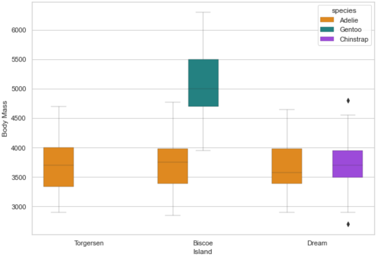

### palmerpenguins
The [Palmer penguins dataset](https://allisonhorst.github.io/palmerpenguins/) by Allison Horst, Alison Hill, and Kristen Gorman was first made publicly available as an [R package](https://cran.r-project.org/web/packages/palmerpenguins/index.html). The goal of the Palmer Penguins dataset is to replace the highly overused Iris dataset for data exploration & visualization.
Using this python package you can easily load the Palmer penguins into your python environment. 


Artwork by @allison_horst

### Installation

```python
pip install palmerpenguins
```

### Overview

Size measurements, clutch observations, and blood isotope ratios for 344 adult foraging Adélie, Chinstrap, and Gentoo penguins observed on islands in the Palmer Archipelago near Palmer Station, Antarctica. Data were collected and made available by [Dr. Kristen Gorman](https://www.uaf.edu/cfos/people/faculty/detail/kristen-gorman.php) and the [Palmer Station, Antarctica Long Term Ecological Research (LTER)](https://pal.lternet.edu/)  Program.

### Examples
```python
import pandas as pd
import seaborn as sns 
from palmerpenguins import load_penguins
sns.set_style('whitegrid')
```

```python
penguins = load_penguins()
penguins.head()

  species     island  bill_length_mm  ...  body_mass_g     sex  year
0  Adelie  Torgersen            39.1  ...       3750.0    male  2007
1  Adelie  Torgersen            39.5  ...       3800.0  female  2007
2  Adelie  Torgersen            40.3  ...       3250.0  female  2007
3  Adelie  Torgersen             NaN  ...          NaN     NaN  2007
4  Adelie  Torgersen            36.7  ...       3450.0  female  2007
[5 rows x 8 columns]
```

```python
g = sns.boxplot(x = 'island',
            y ='body_mass_g',
            hue = 'species',
            data = penguins,
            palette=['#FF8C00','#159090','#A034F0'],
            linewidth=0.3)
g.set_xlabel('Island')
g.set_ylabel('Body Mass')
```
<p align="center">
 
</p>

```python
g = sns.lmplot(x="flipper_length_mm",
               y="body_mass_g",
               hue="species",
               height=7,
               data=penguins,
               palette=['#FF8C00','#159090','#A034F0'])
g.set_xlabels('Flipper Length')
g.set_ylabels('Body Mass')
```
<p align="center">
 
</p>

### License 
Data are available by
[CC-0](https://creativecommons.org/share-your-work/public-domain/cc0/) license in
accordance with the [Palmer Station LTER Data Policy](http://pal.lternet.edu/data/policies)
and the
[LTER Data Access Policy for Type I data](https://lternet.edu/data-access-policy/).

## Bibliography

Gorman KB, Williams TD, Fraser WR (2014) Ecological Sexual Dimorphism and Environmental
Variability within a Community of Antarctic Penguins (Genus Pygoscelis). PLoS ONE 9(3):
e90081. https://doi.org/10.1371/journal.pone.0090081

#### See also

More information about the dataset is available in
[its official documentation](https://allisonhorst.github.io/palmerpenguins/).

The Palmer penguins dataset in Julia:
https://github.com/devmotion/PalmerPenguins.jl
